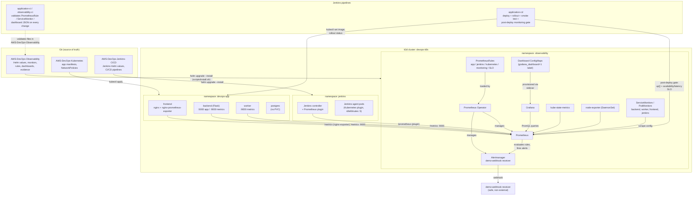

# Observability Architecture

This document describes how monitoring and observability are wired into the `devops-k8s` cluster: what runs where, how metrics flow from the applications and Jenkins into Prometheus, how alerts are routed, and how every piece of this is defined entirely as code across the project's three repositories.

## Diagram

## Components

**Prometheus Operator + Prometheus** — deployed via the `kube-prometheus-stack` Helm chart, values defined in `helm/kube-prometheus-stack/values.yaml`. Prometheus discovers scrape targets exclusively through `ServiceMonitor`/`PodMonitor` CRDs (`prometheus/monitors/`) and loads alerting/recording rules exclusively through `PrometheusRule` CRDs (`prometheus/rules/`) — nothing is scrape-configured or rule-configured by hand inside the cluster.

**Alertmanager** — routes all firing alerts to a `demo-webhook` receiver (`alertmanager/demo-receiver.yaml`), a safe, non-external endpoint used to prove routing works without sending real pages/emails/Slack messages during coursework and failure-exercise testing.

**Grafana** — datasource (Prometheus) and all three required dashboards are provisioned automatically from Git: dashboard JSON files in `grafana/dashboards/` are loaded into ConfigMaps labeled `grafana_dashboard: "1"`, which the chart's dashboard sidecar picks up and imports with zero manual UI configuration.

**kube-state-metrics** and **node-exporter** — deployed as part of the same Helm release, providing Kubernetes object-state metrics (deployment replica counts, pod status, etc.) and node-level OS metrics (CPU, memory, disk, network) respectively.

**Application instrumentation** — `backend` and `worker` (Flask-based) expose `/metrics` on a dedicated port (`:9000`), separate from the application port, covering request counts/latency histograms, an `app_info` metric, and a business metric (records created / files uploaded). `frontend` (nginx) is instrumented via an `nginx-prometheus-exporter` sidecar rather than in-process instrumentation.

**Jenkins** — instrumented via the Jenkins Prometheus plugin, exposing two metric families: `default_jenkins_*` (builds, executors, nodes) and plain `jenkins_*` (queue, health checks, tasks). Scraped via a dedicated `ServiceMonitor` (`prometheus/monitors/jenkins-servicemonitor.yaml`).

## Reproducibility (Observability as Code)

Every component above is defined entirely in Git across the three project repositories — nothing in the `observability` namespace is hand-configured on the cluster. This is proven directly: `scripts/uninstall.sh --with-namespace` tears down the entire namespace, `scripts/install.sh` rebuilds it from these files in under a minute, and `scripts/verify.sh` confirms every expected resource returns. See `evidence/05-reinstall-from-scratch/00-findings.md` for the full proof, including functional double-checks (real scraping resumed, alert routing config reproduced, dashboards rendering live data).

## Troubleshooting history

Several of the sizing and configuration decisions above (Grafana's resource limits, retention values, Kaniko build isolation, ECR credential handling) were driven by real incidents encountered while building this stack. See [`docs/incidents-and-lessons-learned.md`](../docs/incidents-and-lessons-learned.md) for the full writeups.

## Access (local, via `kubectl port-forward`)

| Service | Local URL | Notes |
|---|---|---|
| Prometheus | http://localhost:9090 | |
| Alertmanager | http://localhost:9093 | |
| Grafana | http://localhost:3000 | user `admin`, password via `kubectl get secret` (see README) |
| Jenkins | http://localhost:8081 | credentials via `kubectl get secret` |